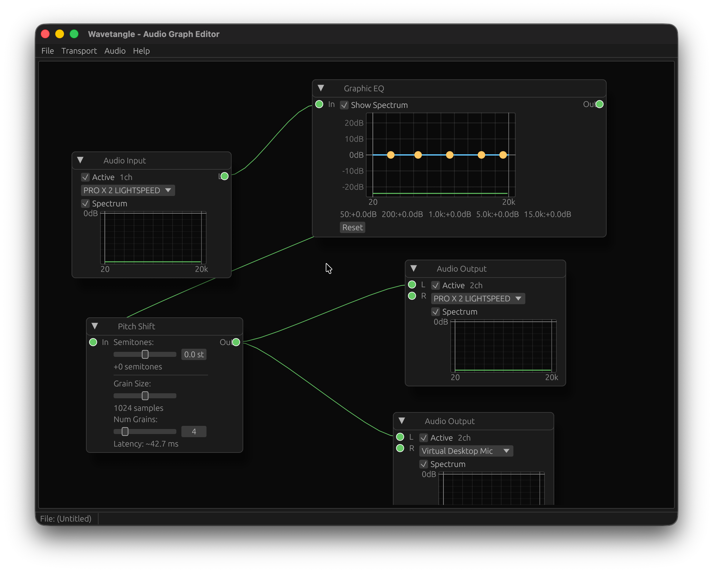

# wavetangle
リアルタイムオーディオ処理ツール  
仮想オーディオミキサーやボイスチェンジャーとしての利用を想定 

## スクリーンショット


## 機能
- オーディオのリアルタイム入出力
- イコライザーとフィルター
- ピッチシフト

## 実行方法
1. このリポジトリをクローン
```sh
git clone https://github.com/uthree/wavetangle
```

2. cargoでビルド、実行
```sh
cd wavetangle
cargo run --release
```
